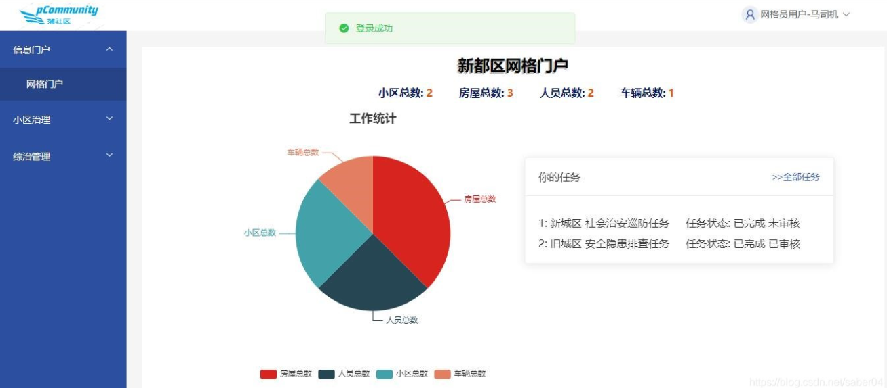
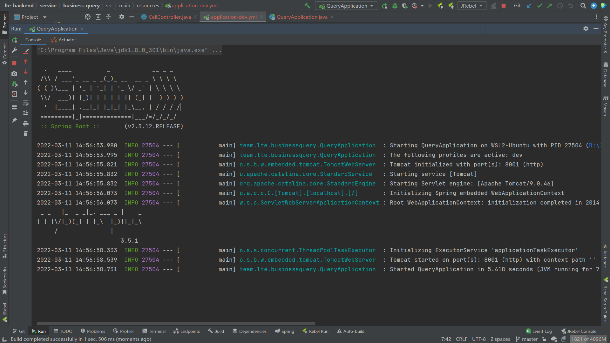
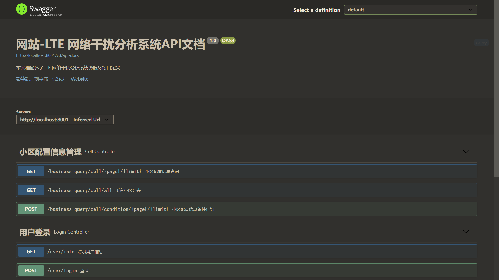
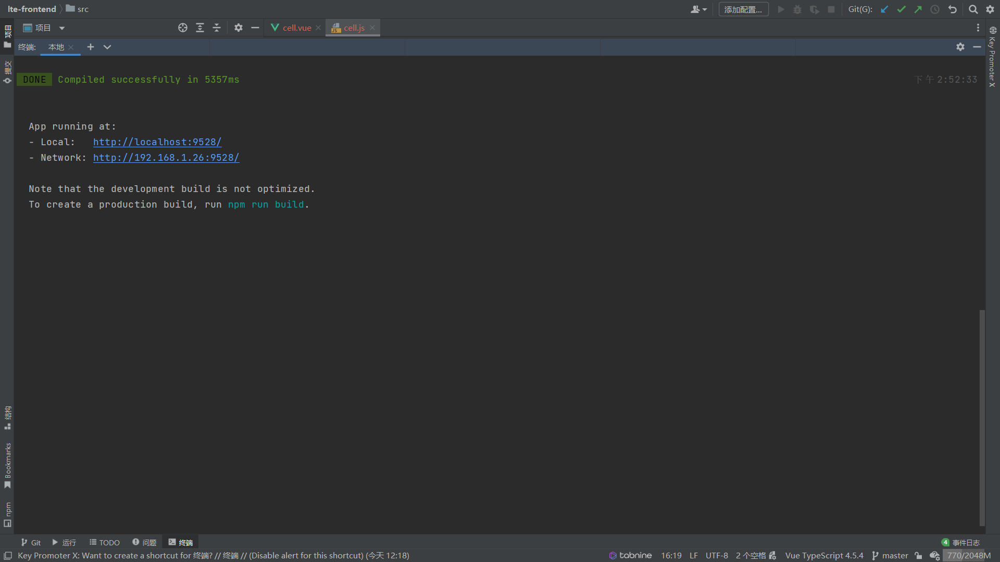
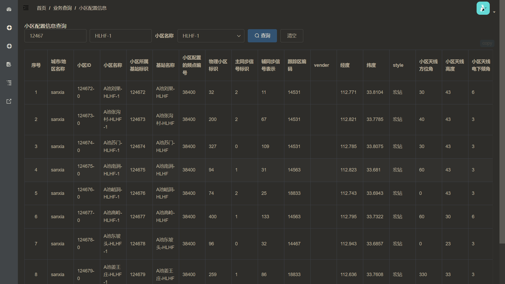

# LTE Analysis System
- [LTE Analysis System](#lte-analysis-system)
  - [介绍](#介绍)
  - [参考项目](#参考项目)
  - [需求分析](#需求分析)
    - [系统界面](#系统界面)
      - [登录界面](#登录界面)
      - [界面布置](#界面布置)
    - [用户管理](#用户管理)
    - [系统管理](#系统管理)
    - [数据管理](#数据管理)
      - [数据导入](#数据导入)
      - [数据导出](#数据导出)
    - [业务查询](#业务查询)
    - [业务分析](#业务分析)
  - [项目运行](#项目运行)
    - [后端](#后端)
    - [前端](#前端)
    - [服务器](#服务器)
  
## 介绍
整体采用B/S架构，前端采用Vue来搭建网页，后端采用Java的SpringBoot架构进行数据处理和分析，数据层采用MySQL数据库进行数据管理，最终完成一个具有系统管理、用户管理、数据管理、数据查询、LTE业务分析功能的网页。
## 参考项目
- [基于Vue+Element+nodejs+Express+mongoDB社区综合治理管理系统
](https://blog.csdn.net/saber04/article/details/107086249)

## 需求分析
具体需要完成的功能有：
### 系统界面
#### 登录界面 
登录界面要求有：
  - 用户登录
    - 需要输入：用户名、用户口令（密码）
  - 用户注册
    - 需要输入：用户类型、用户名、密码、重复密码
  - 撤销登录
    - 从登录状态退回为未登录状态
#### 界面布置
  - 登陆之前为统一的登录页面，登陆后页面改为具体的业务页面。
  - 网页分为多级界面，网页左侧提供一级选择栏
  - 一级界面有：系统管理（只对管理员用户可见）、用户管理、数据管理、业务查询、业务分析五个选项卡。
  - 点击一级界面后，下拉出现二级菜单。
 具体来说，我们设置的二级界面结构需要有：
  - 系统管理
    - 当前数据库连接
    - 数据库配置
  - 用户管理
    - 用户信息（管理员）
    - 修改密码
    - 修改昵称
  - 数据管理
    - 数据导入
    - 数据导出
  - 业务查询
    -  小区配置信息查询
    -  基站 eNodeB 信息查询
    -  小区 KPI 指标信息查询
    -  PRB 信息统计与查询
  - 业务分析
    - 主邻小区 C2I 干扰分析
    - 重叠覆盖干扰小区三元组分析
    - MRO/MRE 测量数据解析【选做】
    - 网络干扰结构分析【选做】
  - 样例如下：
 
### 用户管理
注意事项：
  - 用户名设置为主键，数据至少包含用户类型、用户名、密码、状态（未注册、已注册未登录、已注册已登录）。
  - 用户分为系统管理员和普通用户两类。
  - 用户通过口令、密码登录系统，注意区分**登录系统的口令**和**连接数据库的口令**，**普通用户**不允许知道**连接数据库的口令**。
  - 管理员可以：
    - 在用户管理页面：
      - 查看用户注册信息。
      - 添加删除普通用户。
        - 删除：直接删除用户，此后该用户不能通过该账号登录。
        - 添加：查看到申请的普通用户，然后点击同意使之成功注册。
      - 提升用户权限。（？）
        - 将普通用户升级为管理员。
    - 在系统管理页面：
      - 查看数据库连接、后台数据库服务器及数据库的配置信息
      - 设置、修改数据库连接时长、数据库缓冲区大小等参数。
  - 普通用户可以自己注册，但需要管理员审批通过。
    - 或者：普通用户自己不注册，只能使用管理员分配的帐号，登录系统，完成各项业务查询和业务分析功能。
### 系统管理
- 仅由系统管理员查看
- 可以提供以下信息的查看服务：
  - 当前数据库连接
  - 后台数据库服务器
  - 数据库的配置信息（数据库表所在的物理分区）
- 可以提供对数据库以下修改服务：
  - 修改数据库连接时长
  - 数据库缓冲区大小
### 数据管理
#### 数据导入
功能如下：
- **网络配置信息导入**
从外部导入 Excel 表形式的网络配置信息，即 LTE 网络配置数据库中的小区/基站工参表
tbCell，并存入数据库表 tbCell；
- **KPI 指标信息导入**
从外部导入 Execl 表形式的天级的 KPI 指标统计数据（表“优化区 17 日-19 日 KPI 指标统计表”tbKPI），存入数据库表 tbKPI；
- **PRB 干扰信息导入**
从外部导入 Execl 表形式分钟级的 PRB 干扰数据（表“优化区 17日-19日每PRB干扰查询-15 分钟”tbPRB），存入数据库表 tbPRB；
- **MRO 数据导入**
从外部导入 MRO 测量报告数据表 tbMROData，并存入数据库表 tbMROData；

要求如下：
- 从外部数据文件向数据库中某关系表导入**一条主键值不为空**的数据（对应于一个元组）时。
  - 根据该条数据中的主属性/主键，判断数据库表中是否已有本条数据。
  - 如果本条数据在数据库表中不在，则将该条数据作为新数据插入数据库。
  - 如果本条数据已经存在，用新数据覆盖数据库中的已有旧数据。
  - *通过触发器在数据库级别实现即可*
- 所导入的数据文件的存放位置不固定，应允许用户在界面上选择导入文件的存放路径。
  - *前端完成用户导入功能*
- 从外部数据文件导入数据时，选择表中典型字段，对导入的数据进行清洗，剔除不合格的数据项。
  - 例如，从文件 tbCell.xls 中导入小区配置信息时，对小区的经纬度信息进行清洗。如果发现文件中某行数据的经纬度数据不在合理范围内，该行数据不导入，并在导入日志文件（txt 文件）中记录改行数据编号。
  - *通过数据库触发器完成即可*
- 可以选择要导入的数据库表名/数据库中数据类型(如小区级工参)、要导入的输入文件名和路径。
- 导入时，增加导入进度条。
#### 数据导出
在用户界面上用下拉列表（数据管理-数据导出）显示数据库中的各个关系表，指定某些表，如 tbCell，将表中数据以 Excel或 txt 格式的文件输出。

要求：
- 输出文件中**应当有表中各个属性名称**，输出文件名为**该关系表的名字**。
- 至少从数据库中选择 3 张表，实现数据导出。
- 导出的数据文件在系统中的存放路径必须是**可选**的，不允许在导出程序中采用固定的导出文件存放路径。
- 用户操作流程：
  - 点击数据管理-数据导出，界面显示数据库中各个表的名称。
  - 在对应的表上按“导出”按钮，通过前端选择用户导出文件的路径（也可以自定义文件名称，但默认为表名.csv）。

### 业务查询
- 注意事项：
  - 查询时，要求输入框和下拉列表的方式都实现，2 种方式放在同一个框中。
  - 输入查询条件时，对数值型属性，如 eid，需要进行类型检查，防止输入非数值型数据导致死机。
  - 
- **小区配置信息查询**
    从 tbCell 表中查询小区信息，要求：
    - 用户在查询界面的输入框中直接输入某小区的Cell_ID/Sector_ID或小区名称CellName/SectorName，系统以**列表方式**输出该小区全部信息；
    - 程序在查询界面的下拉列表中列出表tbCell中全部小区名称，用户通过下拉列表选择特定小区名称，以**列表方式**输出该小区全部信息。
- **基站 eNodeB 信息查询**
    从 tbCell 表中查询小区信息，要求：
    - 用户在查询界面的输入框中直接输入某小区的Cell_ID/Sector_ID或小区名称CellName/SectorName，系统以**列表方式**输出该小区全部信息；
    - 用户在查询界面上通过输入框输入基站标识eNodeBID或基站名称 eNodeBName，或者通过下拉列表选择基站标识eNodeBID或基站名称 eNodeBName，以**列表方式**输出该基站全部小区信息。
- **小区 KPI 指标信息查询**
    - 用户在查询界面上通过输入框输入小区名称，或者通过下拉列表选定表tbKPI 中的某个特定小区。
    - 在右侧显示选择小区的属性列表。
    - **添加时间控件**：查询网元某个时间段（天级）某个属性值的变化情况，并将结果用**柱状图**或**折线图**的方式呈现出来，例如查询网元从2016年7月17日到7月19日的RRC连接重建比率(%)。
- **PRB 信息统计与查询**
    - **统计功能** 根据表“优化区 17 日-19 日每 PRB 干扰 查询-15 分钟”，统计小时级的 PRB 干扰数据，生成一张新表 tbPRBnew，并导出到外部的 Excel 表中。
    - 根据得到的小时级的 PRB 干扰数据表，在界面上根据网元名称以输入框或者下拉列表的方式选定某个特定网元，在右侧显示其属性列表，添加时间控件，查询网元某个时间段（小时级）某个属性值的变化情况，并将结果用柱状图或折线图的方式呈现出来。
      - 例如查询网元某一天从01:00:00 到 13：00：00 每个小时内第 60 个 PRB 上检测到的干扰噪声的平均值。也可将时间段缩小到分钟级，此时用 tbPRB 进行查询，总之查询的时间粒度要和表对应。
### 业务分析
- **主邻小区 C2I 干扰分析** 
  - 点击分析后，根据使用说明书给出的公式和分析，根据当前的数据库数据给出当前的新表tbC2Inew，并于前端展示数据。
- **重叠覆盖干扰小区三元组分析**
  - 根据表 tbC2Inew，找出所有的小区三元组\<a, b, c\>，其中 a、b、c 互为邻小区，并生成新表 tbC2I3，该表有三个属性，分别是三个小区的小区标识 ID，具体如实验说明书。


## 项目运行

### 后端

`lte-backend`，SpringBoot项目，IntelliJ IDEA可用正常打开并识别出Maven，其他IDE不清楚。

* 安装依赖（推荐是让IDE自己做，手动怎么装这么多 `pom.xml` 我也不造）

* 启动服务
  
  1. 启动服务主程序[`QueryApplication.java`](lte-backend/service/business-query/src/main/java/team/lte/businessquery/QueryApplication.java)

  
  
* 接口测试

  项目整合了Swagger3.0用于测试Springboot中的各个接口，接口返回全部统一使用自定义类型 [`R`](lte-backend/common/common-utils/src/main/java/team/lte/commonutils/result/R.java)。

  


### 前端

`lte-frontend`，Vue项目，可用VSCode，WebStorm等打开。

* 安装依赖

  ```shell
  npm install
  ```

* 启动服务

  ```shell
  npm run dev
  ```

  

* 网页访问

  ```shell
  http://localhost:9528
  登录用户名：admin
  登录密码：111111
  目前登录完了并不能注销，想看登录界面可用开无痕浏览或清理缓存。
  ```
  
  

### 服务器

* 项目已部署至服务器120.48.19.4，远程连接用户名 `root`，密码 `Q6^pw0*lb$@Ezv#7`（服务器密码居然不能包含 `&` 字符）。1核2G垃圾服务器，项目跑起来后剩不下多少内存了，折腾的时候得悠着点 :thinking: 。

* 前端通过 `80` 端口转发，可以直接通过 [http://120.48.19.4](http://120.48.19.4) 访问。

* Swagger依旧通过 `8001` 端口访问： [http://120.48.19.4:8001/swagger-ui/index.html](http://120.48.19.4:8001/swagger-ui/index.html) 。

* 数据库使用 `120.48.19.4` 的 `3306` 端口，远程连接用户名 `root`，密码 `Q6^pw0*lb$@Ezv#&`。本地不需要再配置数据库了（白嫖使人快乐 :stuck_out_tongue_winking_eye: 。

* Jenkins使用 `120.48.19.4` 的 `8080` 端口，可以通过 [http://120.48.19.4:8080](http://120.48.19.4:8080) 访问，登录用户名 `root`，密码 `Q6^pw0*lb$@Ezv#&`。

* 前后端代码分为两个环境：dev为本地调试环境，prod为线上环境。为了方便线上运行，项目默认使用prod环境，使用dev环境在本地运行需要加参数：
  * 后端使用dev环境进行本地开发：[IntelliJ IDEA 配置SpringBoot项目 启动环境](https://blog.csdn.net/jx520/article/details/109711189) 。本地运行时依旧提供 [http://localhost:8001](http://localhost:8001) 的相关接口，如通过 [http://localhost:8001/swagger-ui/index.html](http://localhost:8001/swagger-ui/index.html) 访问dev环境的Swagger。
  
  * 前端不需要特别的设置， `npm run dev` 依旧使用dev环境，`npm run build:prod` 打包项目时使用prod环境（本地点开 `index.html` 似乎没啥反应）。本地运行端口依旧是9528，即访问 [http://localhost:9528](http://localhost:9528)。
